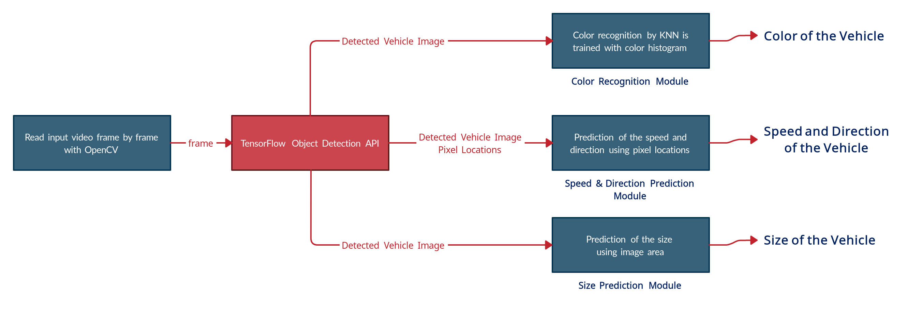

# transport-counting
simple counting transportation with object detection and tensorflow


## general capabilities

this sample project has more than just counting vehicles, here are the additional capabilites of it:

- detection and classification of the vehicle (car, truck, biycles, motorcycle, bus)
- Recognition of approximate vehicle color
- detection of vehicle direction of travel
- prediction the speed of the vehicle
- prediction of approximate vehicle size

## theory



- vehicle detection and classification have been developed using TensorFlow object detection API
- vehicle speed predicition has been developed using OpenCVA via image pixel manipulation and calculation
- vehicle color prediction has been developed using OpenCV via k-nearest neighbours machine learning classification algorithm trained color histogram features

## installation

**docker setup with nvdia gpu**


run the demo in the GPU without installing anything, just nvidia docker
```
docker-compose up
```

alternative for nvidia-docker

1. python and pip
   ```
   sudo apt-get install python3-pip python3-dev
   ```
2. OpenCV
   See required command to install openCV on ubuntu [here](https://gist.github.com/dynamicguy/3d1fce8dae65e765f7c4)
3. TensorFlow
   install the tensorflow by invoking one of the following commands
   ```
   pip3 install tensorflow
   pip3 install tensorflow-gpu
   ```
   current program is compatible with tensorflow 1.5.0

## running program

program tekes an input argument ``imshow`` or ``imwrite``

```
python3 vehicle_detection_main.py imshow
python3 vehicle_detection_main.py imwrite
```

- ``imshow``: show the processsed frames as an video on screen.
- ``imwrite``: saves the processed frames as an output video in the project root folder.